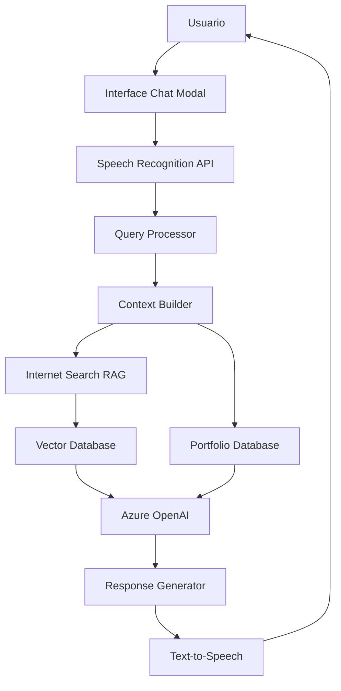

# 🤖 Portfolio Chat Conversacional con RAG y Voz - Análisis Técnico Completo

**Fecha de Análisis**: 6 de noviembre de 2025  
**Versión Portfolio**: 1.0.8  
**Autor**: Juan Carlos Macías  

---

## 📋 **Resumen Ejecutivo**

Análisis para implementar un sistema de chat conversacional innovador que combina:
- **RAG (Retrieval-Augmented Generation)** con búsqueda semántica en internet
- **Interfaz conversacional con voz** (speech-to-text y text-to-speech)
- **Contexto enriquecido** del portfolio con información externa
- **Experiencia inmersiva** que posiciona el portfolio como tecnológicamente avanzado

---

## 🎯 **Objetivos del Sistema**

### **Primarios:**
- Crear una experiencia conversacional única e innovadora
- Demostrar capacidades técnicas avanzadas en IA y desarrollo
- Proporcionar información completa y actualizada sobre Juan Carlos Macías
- Diferenciación competitiva en el mercado laboral

### **Secundarios:**
- Lead generation inteligente
- Analytics de interacciones
- Showcase de tecnologías emergentes
- Accesibilidad mejorada

---

## 🏗️ **Arquitectura del Sistema RAG**

### **1. Componentes Core**



### **2. Stack Tecnológico Propuesto**

#### **Backend (PHP)**
```php
// Sistema RAG principal
class PortfolioRAGSystem {
    private $searchEngine;      // Bing Search API / Google Custom Search
    private $vectorDB;          // ChromaDB / Pinecone
    private $embeddings;        // Azure OpenAI Embeddings
    private $llm;               // Azure OpenAI GPT-4
    private $portfolioContext;  // Contexto local del portfolio
}
```

#### **Frontend (React)**
```jsx
// Componente principal del chat
<AdvancedPortfolioChat 
    enableVoice={true}
    enableRAG={true}
    contextSources={['portfolio', 'internet', 'social']}
/>
```

#### **APIs Externas Necesarias**
- **Azure Cognitive Search**: Búsqueda semántica
- **Bing Search API**: Búsqueda en internet
- **Azure Speech Services**: STT y TTS
- **Azure OpenAI**: Embeddings y GPT-4
- **LinkedIn API**: Información profesional actualizada

---

## 🔍 **Sistema RAG: Búsqueda Semántica en Internet**

### **1. Fuentes de Información Externa**

#### **Búsquedas Automáticas:**
```javascript
const searchQueries = [
    "Juan Carlos Macías desarrollador Madrid",
    "Juan Carlos Macías portfolio GitHub",
    "JCMS desarrollador full stack IA",
    "Juan Carlos Macías Factoría F5 bootcamp",
    "desarrollador React PHP Madrid 2025",
    "Konglu.es aplicación glucémica Juan Carlos",
    "CEIP Barcelona Madrid desarrollador web"
];
```

#### **APIs de Búsqueda:**
```php
class InternetRAGSearcher {
    private $searchAPIs = [
        'bing' => 'https://api.bing.microsoft.com/v7.0/search',
        'google' => 'https://www.googleapis.com/customsearch/v1',
        'duckduckgo' => 'https://api.duckduckgo.com/',
        'linkedin' => 'https://api.linkedin.com/v2/people'
    ];
    
    public function searchPortfolioReferences($query) {
        // Implementar búsqueda multi-fuente
        // Filtrar resultados relevantes
        // Generar embeddings para similaridad
    }
}
```

### **2. Vector Database para Contexto**

#### **Estructura de Datos:**
```json
{
    "chunks": [
        {
            "id": "portfolio_about_001",
            "content": "Juan Carlos Macías, desarrollador full stack...",
            "source": "portfolio_local",
            "embedding": [0.1, 0.2, 0.3, ...],
            "metadata": {
                "type": "personal_info",
                "relevance": 0.95,
                "last_updated": "2025-11-06"
            }
        },
        {
            "id": "internet_linkedin_001", 
            "content": "Juan Carlos Macías - LinkedIn profile...",
            "source": "linkedin_api",
            "embedding": [0.2, 0.1, 0.4, ...],
            "metadata": {
                "type": "professional_info",
                "relevance": 0.88,
                "url": "https://linkedin.com/in/juancmacias"
            }
        }
    ]
}
```

### **3. Algoritmo de Búsqueda Semántica**

```python
class SemanticSearchEngine:
    def search_relevant_context(self, user_query, k=5):
        # 1. Generar embedding de la consulta
        query_embedding = self.get_embedding(user_query)
        
        # 2. Búsqueda por similaridad coseno
        similar_chunks = self.vector_db.similarity_search(
            query_embedding, k=k
        )
        
        # 3. Re-ranking por relevancia y freshness
        ranked_results = self.rerank_results(similar_chunks)
        
        # 4. Construir contexto enriquecido
        return self.build_enriched_context(ranked_results)
```

---

## 🎤 **Sistema de Voz Conversacional**

### **1. Speech-to-Text (STT)**

#### **Azure Speech Services**
```javascript
// Configuración STT
const speechConfig = SpeechSDK.SpeechConfig.fromSubscription(
    "tu-azure-key", "tu-region"
);
speechConfig.speechRecognitionLanguage = "es-ES";

// Reconocimiento continuo
const recognizer = new SpeechSDK.SpeechRecognizer(speechConfig);
recognizer.recognizeOnceAsync(result => {
    processVoiceInput(result.text);
});
```

#### **Web Speech API (Fallback)**
```javascript
// Alternativa nativa del navegador
const recognition = new (window.SpeechRecognition || 
                          window.webkitSpeechRecognition)();
recognition.lang = 'es-ES';
recognition.continuous = true;
recognition.interimResults = true;
```

### **2. Text-to-Speech (TTS)**

#### **Azure Neural Voices**
```javascript
// Voz española neural
const speechConfig = SpeechSDK.SpeechConfig.fromSubscription(key, region);
speechConfig.speechSynthesisVoiceName = "es-ES-AlvaroNeural";

const synthesizer = new SpeechSDK.SpeechSynthesizer(speechConfig);
synthesizer.speakTextAsync(response);
```

#### **Configuración de Voz Personalizada**
```xml
<speak version="1.0" xmlns="http://www.w3.org/2001/10/synthesis" xml:lang="es-ES">
    <voice name="es-ES-AlvaroNeural">
        <prosody rate="medium" pitch="medium">
            Hola, soy el asistente virtual de Juan Carlos Macías.
            <break time="300ms"/>
            ¿En qué puedo ayudarte hoy?
        </prosody>
    </voice>
</speak>
```

---

## 🗄️ **Estructura de Base de Datos Expandida**

### **1. Tablas Nuevas para RAG**

```sql
-- Vector embeddings para búsqueda semántica
CREATE TABLE portfolio_embeddings (
    id INT AUTO_INCREMENT PRIMARY KEY,
    content_id VARCHAR(100) UNIQUE,
    content_text TEXT,
    embedding_vector JSON,
    source_type ENUM('portfolio', 'internet', 'social', 'github'),
    source_url VARCHAR(500),
    relevance_score FLOAT,
    last_updated TIMESTAMP DEFAULT CURRENT_TIMESTAMP,
    metadata JSON
);

-- Historial de búsquedas externas
CREATE TABLE external_searches (
    id INT AUTO_INCREMENT PRIMARY KEY,
    search_query TEXT,
    search_engine VARCHAR(50),
    results_count INT,
    response_time_ms INT,
    created_at TIMESTAMP DEFAULT CURRENT_TIMESTAMP
);

-- Conversaciones con contexto enriquecido
CREATE TABLE enriched_conversations (
    id INT AUTO_INCREMENT PRIMARY KEY,
    session_id VARCHAR(100),
    user_message TEXT,
    user_voice_input BOOLEAN DEFAULT FALSE,
    bot_response TEXT,
    bot_voice_output BOOLEAN DEFAULT FALSE,
    context_sources JSON,
    rag_chunks_used JSON,
    response_time_ms INT,
    satisfaction_score INT,
    created_at TIMESTAMP DEFAULT CURRENT_TIMESTAMP
);

-- Cache de resultados externos
CREATE TABLE external_content_cache (
    id INT AUTO_INCREMENT PRIMARY KEY,
    content_hash VARCHAR(64) UNIQUE,
    content_text TEXT,
    source_url VARCHAR(500),
    title VARCHAR(200),
    snippet TEXT,
    last_crawled TIMESTAMP DEFAULT CURRENT_TIMESTAMP,
    expiry_date TIMESTAMP,
    is_valid BOOLEAN DEFAULT TRUE
);
```

### **2. Índices para Rendimiento**

```sql
-- Índices para búsqueda rápida
CREATE INDEX idx_embeddings_source ON portfolio_embeddings(source_type);
CREATE INDEX idx_embeddings_relevance ON portfolio_embeddings(relevance_score);
CREATE INDEX idx_conversations_session ON enriched_conversations(session_id);
CREATE INDEX idx_cache_hash ON external_content_cache(content_hash);
CREATE FULLTEXT INDEX idx_content_search ON portfolio_embeddings(content_text);
```

---

## 🚀 **Implementación por Fases**

### **Fase 1: Chat Básico con RAG Local (2-3 semanas)**
- ✅ Chat modal en React
- ✅ Contexto del portfolio existente
- ✅ Búsqueda semántica local
- ✅ Azure OpenAI integration

### **Fase 2: RAG con Internet (3-4 semanas)**
- 🔄 Implementar Bing Search API
- 🔄 Sistema de embeddings
- 🔄 Vector database (ChromaDB)
- 🔄 Cache inteligente de resultados

### **Fase 3: Capacidades de Voz (2-3 semanas)**
- 🔄 Speech-to-Text integration
- 🔄 Text-to-Speech con voz neural
- 🔄 Interfaz de voz optimizada
- 🔄 Fallbacks para compatibilidad

### **Fase 4: Optimización y Analytics (1-2 semanas)**
- 🔄 Métricas de rendimiento
- 🔄 A/B testing de respuestas
- 🔄 Mejoras de UX basadas en datos
- 🔄 Optimización de costos

---

## 💰 **Estimación de Costos**

### **Azure Services (Mensual)**

| Servicio | Uso Estimado | Costo Aprox. |
|----------|--------------|--------------|
| Azure OpenAI (GPT-4) | 100K tokens | $3-5 |
| Azure Speech Services | 10 horas | $1-2 |
| Bing Search API | 1000 queries | $3-7 |
| Azure Cognitive Search | 10GB index | $250/mes |
| **Total Mensual** | - | **$257-264** |

### **Alternativas Gratuitas/Económicas**

| Servicio | Alternativa | Costo |
|----------|-------------|--------|
| Azure OpenAI | Groq (Llama-3) | Gratis |
| Bing Search | DuckDuckGo API | Gratis |
| Azure Speech | Web Speech API | Gratis |
| Vector DB | ChromaDB local | Gratis |
| **Total Alternativo** | - | **$0-10/mes** |

---

## 🎨 **Experiencia de Usuario Propuesta**

### **1. Flujo de Conversación**

```
👤 Usuario: [Habla o escribe] "¿Qué experiencia tiene Juan Carlos con React?"

🤖 Sistema:
1. Transcribe voz (si aplica)
2. Analiza intent: "experiencia_tecnologia"
3. Busca en portfolio local: proyectos React
4. Busca en internet: referencias externas
5. Genera respuesta contextualizada
6. Convierte a voz (si está habilitado)

🗣️ Respuesta: "Juan Carlos tiene amplia experiencia con React. 
En su portfolio personal utiliza React con componentes como MetaData, 
Analytics y sistemas de routing avanzados. También encontré que ha 
trabajado en proyectos como Thinking With You desplegado en Vercel, 
y según su perfil de LinkedIn, ha completado recientemente un bootcamp 
en IA donde integró React con sistemas de machine learning..."
```

### **2. Interface Modal Avanzada**

```jsx
<AdvancedPortfolioChatModal>
  <VoiceControls 
    sttEnabled={true}
    ttsEnabled={true}
    voiceCommands={['buscar', 'proyectos', 'contacto']}
  />
  <ChatHistory 
    enableExport={true}
    showSources={true}
    contextHighlight={true}
  />
  <QuickActions>
    <Button>Ver Proyectos Mencionados</Button>
    <Button>Contactar Juan Carlos</Button>
    <Button>Descargar CV</Button>
  </QuickActions>
</AdvancedPortfolioChatModal>
```

---

## 🔒 **Consideraciones de Seguridad y Privacidad**

### **1. Protección de Datos**
- **Encriptación**: Todas las conversaciones encriptadas
- **Retention Policy**: Automática limpieza de datos personales
- **GDPR Compliance**: Derecho al olvido implementado
- **Rate Limiting**: Prevención de abuso de APIs

### **2. Filtros de Contenido**
```php
class ContentFilter {
    private $blockedKeywords = ['password', 'personal', 'private'];
    private $sensitivePatterns = ['/\b\d{4}\s\d{4}\s\d{4}\s\d{4}\b/'];
    
    public function filterResponse($content) {
        // Implementar filtros de seguridad
        // Remover información sensible
        // Validar fuentes externas
    }
}
```

---

## 📊 **Métricas y Analytics**

### **1. KPIs del Sistema**
- **Engagement Rate**: Duración promedio de conversaciones
- **Conversion Rate**: Visitantes que contactan después del chat
- **Accuracy Score**: Relevancia de respuestas (feedback usuario)
- **Performance Metrics**: Tiempo de respuesta, uptime
- **Cost Efficiency**: Costo por conversación exitosa

### **2. Dashboard de Métricas**
```php
class ChatAnalytics {
    public function getDashboardData() {
        return [
            'daily_conversations' => $this->getDailyStats(),
            'popular_topics' => $this->getTopQueries(),
            'user_satisfaction' => $this->getSatisfactionScores(),
            'rag_effectiveness' => $this->getRAGMetrics(),
            'voice_usage' => $this->getVoiceStats()
        ];
    }
}
```

---

## 🔮 **Innovaciones Futuras Posibles**

### **1. Características Avanzadas**
- **Multimodal Chat**: Análisis de imágenes y documentos
- **Real-time Collaboration**: Chat compartido con recruiters
- **AI Avatar**: Representación visual de Juan Carlos
- **Context Memory**: Recordar conversaciones previas
- **Proactive Suggestions**: Sugerir información relevante

### **2. Integraciones Expandidas**
- **GitHub API**: Estado de repositorios en tiempo real
- **Calendar API**: Disponibilidad para reuniones
- **Email Integration**: Envío automático de información
- **Social Media**: Actualizaciones automáticas de redes

---

## ✅ **Conclusiones y Recomendaciones**

### **Viabilidad Técnica: ⭐⭐⭐⭐⭐**
- **Infraestructura Existente**: Perfecta para expandir
- **Conocimientos Técnicos**: Juan Carlos tiene las habilidades necesarias
- **Diferenciación**: Innovación única en portfolios

### **Estrategia Recomendada:**

1. **Inicio con Fase 1**: Chat básico con RAG local usando Groq
2. **Validación de Concepto**: Medir engagement y feedback
3. **Expansión Gradual**: Añadir funcionalidades según demanda
4. **Monetización Potencial**: Ofrecer sistema como servicio a otros desarrolladores

### **Impacto Esperado:**
- **Diferenciación Competitiva**: Portfolio único en el mercado
- **Lead Generation**: Mejor calificación de oportunidades
- **Showcase Tecnológico**: Demostración práctica de habilidades IA
- **Experiencia Usuario**: Interacción memorable y eficiente

---

## 📚 **Recursos y Referencias**

### **Documentación Técnica**
- [Azure OpenAI Service](https://azure.microsoft.com/en-us/products/cognitive-services/openai-service)
- [Azure Speech Services](https://azure.microsoft.com/en-us/products/cognitive-services/speech-services)
- [Bing Search API v7](https://docs.microsoft.com/en-us/bing/search-apis/)
- [ChromaDB Documentation](https://docs.trychroma.com/)
- [React Speech Kit](https://github.com/MikeyParton/react-speech-kit)

### **Ejemplos de Implementación**
```bash
# Repositorios de referencia
git clone https://github.com/microsoft/azure-speech-services-samples
git clone https://github.com/openai/openai-cookbook
git clone https://github.com/langchain-ai/langchain
```

### **Artículos y Tutoriales**
- "Building RAG Applications with Azure" - Microsoft Docs
- "Implementing Voice Interfaces with React" - Medium
- "Vector Databases for Semantic Search" - Towards Data Science
- "Cost Optimization in AI Applications" - Azure Blog

---

**Documento generado el**: 6 de noviembre de 2025  
**Autor**: Juan Carlos Macías  
**Versión**: 1.0  
**Estado**: Análisis Técnico Completo  

*Este documento serve como guía completa para la implementación del sistema de chat conversacional más innovador en portfolios de desarrolladores.*