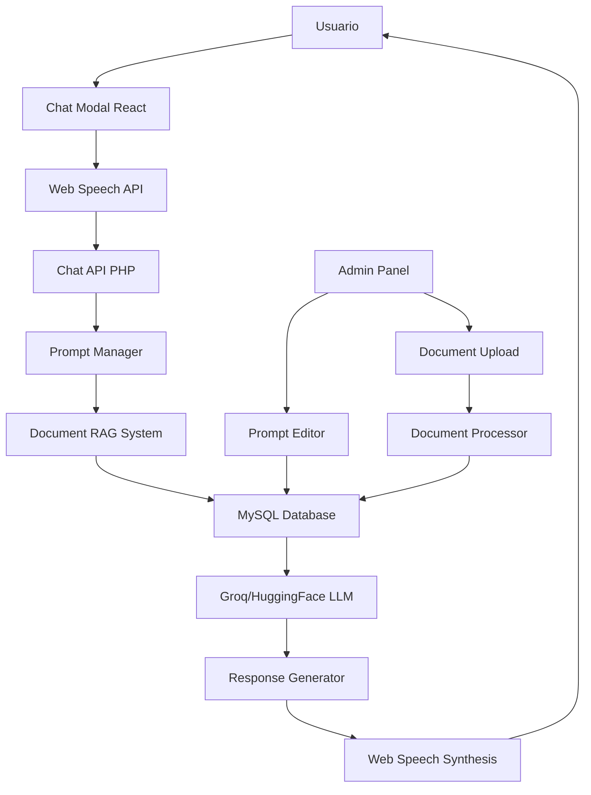

# 🔧 Portfolio Chat RAG - Análisis Adaptado con Groq + HuggingFace + MySQL

**Fecha de Análisis**: 6 de noviembre de 2025  
**Versión Adaptada**: 1.1 - Infraestructura Existente  
**Stack Optimizado**: Groq + HuggingFace + MySQL + Admin Panel  

---

## 🎯 **Análisis de Optimización con Recursos Existentes**

### **✅ Ventajas de la Arquitectura Propuesta:**
- **🆓 Costo CERO**: Groq y HuggingFace gratuitos
- **🚀 Implementación Rápida**: Usa infraestructura existente
- **🔧 Control Total**: Admin panel para gestión completa
- **📊 Base MySQL**: Aprovecha sistema actual
- **🎤 Voces Locales**: Web Speech API nativo

---

## 🏗️ **Arquitectura Optimizada**

### **1. Stack Tecnológico Final**



### **2. Componentes Core Adaptados**

#### **LLM Providers (Gratis)**
```php
class OptimizedAIProvider {
    private $providers = [
        'groq' => new GroqProvider(),           // GRATIS - Llama 3, Mixtral
        'huggingface' => new HuggingFaceProvider() // GRATIS - Múltiples modelos
    ];
    
    // Sin Azure OpenAI - Solo providers gratuitos
    private $defaultProvider = 'groq';
}
```

#### **Voz Nativa del Navegador**
```javascript
// Web Speech API - GRATIS y nativo
const speechRecognition = new (window.SpeechRecognition || 
                                window.webkitSpeechRecognition)();
const speechSynthesis = window.speechSynthesis;

// Sin necesidad de Azure Speech Services
```

---

## 📊 **Base de Datos MySQL Expandida**

### **1. Tablas para Sistema RAG Completo**

```sql
-- Gestión de prompts personalizables
CREATE TABLE chat_prompts (
    id INT AUTO_INCREMENT PRIMARY KEY,
    prompt_name VARCHAR(100) UNIQUE NOT NULL,
    prompt_type ENUM('system', 'context', 'personality', 'response') NOT NULL,
    prompt_text LONGTEXT NOT NULL,
    variables JSON, -- Variables dinámicas: {name}, {portfolio_info}
    is_active BOOLEAN DEFAULT TRUE,
    priority INT DEFAULT 0,
    created_by VARCHAR(100),
    created_at TIMESTAMP DEFAULT CURRENT_TIMESTAMP,
    updated_at TIMESTAMP DEFAULT CURRENT_TIMESTAMP ON UPDATE CURRENT_TIMESTAMP,
    
    INDEX idx_prompt_type (prompt_type),
    INDEX idx_is_active (is_active),
    INDEX idx_priority (priority)
);

-- Documentos de referencia subidos por admin
CREATE TABLE reference_documents (
    id INT AUTO_INCREMENT PRIMARY KEY,
    document_name VARCHAR(255) NOT NULL,
    document_type ENUM('pdf', 'txt', 'docx', 'md', 'url') NOT NULL,
    file_path VARCHAR(500),
    original_filename VARCHAR(255),
    file_size INT,
    content_extracted LONGTEXT,
    content_summary TEXT,
    metadata JSON,
    tags JSON,
    is_active BOOLEAN DEFAULT TRUE,
    upload_date TIMESTAMP DEFAULT CURRENT_TIMESTAMP,
    last_processed TIMESTAMP,
    processing_status ENUM('pending', 'processing', 'completed', 'error') DEFAULT 'pending',
    
    INDEX idx_document_type (document_type),
    INDEX idx_is_active (is_active),
    INDEX idx_processing_status (processing_status),
    FULLTEXT INDEX idx_content_search (content_extracted, content_summary)
);

-- Fragmentos de documentos para RAG
CREATE TABLE document_chunks (
    id INT AUTO_INCREMENT PRIMARY KEY,
    document_id INT NOT NULL,
    chunk_index INT NOT NULL,
    chunk_text LONGTEXT NOT NULL,
    chunk_summary TEXT,
    chunk_keywords JSON,
    relevance_score FLOAT DEFAULT 0.0,
    word_count INT DEFAULT 0,
    created_at TIMESTAMP DEFAULT CURRENT_TIMESTAMP,
    
    FOREIGN KEY (document_id) REFERENCES reference_documents(id) ON DELETE CASCADE,
    INDEX idx_document_id (document_id),
    INDEX idx_chunk_index (chunk_index),
    INDEX idx_relevance_score (relevance_score),
    FULLTEXT INDEX idx_chunk_search (chunk_text, chunk_summary)
);

-- Configuración del sistema de chat
CREATE TABLE chat_configuration (
    id INT AUTO_INCREMENT PRIMARY KEY,
    config_key VARCHAR(100) UNIQUE NOT NULL,
    config_value LONGTEXT,
    config_type ENUM('string', 'json', 'boolean', 'integer', 'float') DEFAULT 'string',
    description TEXT,
    is_editable BOOLEAN DEFAULT TRUE,
    created_at TIMESTAMP DEFAULT CURRENT_TIMESTAMP,
    updated_at TIMESTAMP DEFAULT CURRENT_TIMESTAMP ON UPDATE CURRENT_TIMESTAMP,
    
    INDEX idx_config_key (config_key)
);

-- Conversaciones mejoradas con contexto de documentos
CREATE TABLE enhanced_conversations (
    id INT AUTO_INCREMENT PRIMARY KEY,
    session_id VARCHAR(100) NOT NULL,
    message_id VARCHAR(100) UNIQUE NOT NULL,
    user_message LONGTEXT,
    bot_response LONGTEXT,
    prompt_used_id INT,
    documents_referenced JSON, -- IDs de documentos usados
    chunks_used JSON, -- IDs de chunks específicos
    llm_provider VARCHAR(50),
    llm_model VARCHAR(100),
    processing_time_ms INT DEFAULT 0,
    user_feedback ENUM('positive', 'negative', 'neutral'),
    admin_notes TEXT,
    created_at TIMESTAMP DEFAULT CURRENT_TIMESTAMP,
    
    FOREIGN KEY (prompt_used_id) REFERENCES chat_prompts(id),
    INDEX idx_session_id (session_id),
    INDEX idx_message_id (message_id),
    INDEX idx_llm_provider (llm_provider),
    INDEX idx_user_feedback (user_feedback),
    INDEX idx_created_at (created_at)
);

-- Sistema de embeddings simplificado (sin vectores complejos)
CREATE TABLE simple_embeddings (
    id INT AUTO_INCREMENT PRIMARY KEY,
    content_id VARCHAR(100) UNIQUE NOT NULL,
    content_type ENUM('portfolio', 'document', 'chunk', 'project') NOT NULL,
    content_text LONGTEXT NOT NULL,
    keywords JSON,
    tf_idf_vector JSON, -- Vector TF-IDF simple
    related_content JSON, -- IDs de contenido relacionado
    created_at TIMESTAMP DEFAULT CURRENT_TIMESTAMP,
    updated_at TIMESTAMP DEFAULT CURRENT_TIMESTAMP ON UPDATE CURRENT_TIMESTAMP,
    
    INDEX idx_content_type (content_type),
    FULLTEXT INDEX idx_content_text (content_text)
);
```

---

## 🎛️ **Panel de Administración Expandido**

### **1. Sección: Gestión de Prompts**

#### **Interfaz Admin: Prompt Editor**
```php
// admin/pages/chat-prompt-manager.php
class ChatPromptManager {
    private $db;
    
    public function getPromptCategories() {
        return [
            'system' => [
                'name' => 'Prompts del Sistema',
                'description' => 'Personalidad y comportamiento base del chatbot',
                'examples' => [
                    'personality_base' => 'Eres un asistente virtual que representa a Juan Carlos Macías...',
                    'response_style' => 'Responde de manera profesional pero cercana...',
                    'language_preference' => 'Responde siempre en español...'
                ]
            ],
            'context' => [
                'name' => 'Prompts de Contexto',
                'description' => 'Cómo usar la información del portfolio y documentos',
                'examples' => [
                    'portfolio_integration' => 'Usa la siguiente información del portfolio: {portfolio_data}',
                    'document_reference' => 'Basándote en los documentos: {document_chunks}',
                    'project_details' => 'Información de proyectos: {project_info}'
                ]
            ],
            'personality' => [
                'name' => 'Personalidad del Chat',
                'description' => 'Tono y estilo de comunicación',
                'examples' => [
                    'professional_tone' => 'Mantén un tono profesional pero accesible...',
                    'technical_expertise' => 'Demuestra conocimiento técnico cuando sea relevante...',
                    'helpful_attitude' => 'Sé proactivo en ofrecer información útil...'
                ]
            ],
            'response' => [
                'name' => 'Formato de Respuestas',
                'description' => 'Estructura y formato de las respuestas',
                'examples' => [
                    'response_structure' => 'Estructura tus respuestas: introducción, desarrollo, conclusión',
                    'length_control' => 'Mantén respuestas entre 100-300 palabras...',
                    'call_to_action' => 'Incluye una pregunta de seguimiento al final'
                ]
            ]
        ];
    }
}
```

#### **Interface React: Prompt Editor**
```jsx
const PromptEditor = () => {
    const [prompts, setPrompts] = useState([]);
    const [selectedPrompt, setSelectedPrompt] = useState(null);
    const [isEditing, setIsEditing] = useState(false);
    
    const promptVariables = {
        '{name}': 'Juan Carlos Macías',
        '{portfolio_data}': 'Información dinámica del portfolio',
        '{document_chunks}': 'Fragmentos de documentos relevantes',
        '{project_info}': 'Detalles de proyectos específicos',
        '{user_query}': 'Pregunta del usuario',
        '{context}': 'Contexto de la conversación'
    };
    
    return (
        <div className="prompt-editor">
            <Card>
                <Card.Header>
                    <h4>🎭 Editor de Prompts del Chatbot</h4>
                    <Button onClick={() => setIsEditing(true)}>
                        Nuevo Prompt
                    </Button>
                </Card.Header>
                
                <Card.Body>
                    <Row>
                        <Col md={4}>
                            <h5>Categorías de Prompts</h5>
                            <ListGroup>
                                {promptCategories.map(category => (
                                    <ListGroup.Item 
                                        key={category.type}
                                        onClick={() => loadPromptsOfType(category.type)}
                                    >
                                        <strong>{category.name}</strong>
                                        <br />
                                        <small className="text-muted">
                                            {category.description}
                                        </small>
                                    </ListGroup.Item>
                                ))}
                            </ListGroup>
                        </Col>
                        
                        <Col md={8}>
                            {selectedPrompt && (
                                <PromptEditForm 
                                    prompt={selectedPrompt}
                                    variables={promptVariables}
                                    onSave={handleSavePrompt}
                                    onTest={handleTestPrompt}
                                />
                            )}
                        </Col>
                    </Row>
                </Card.Body>
            </Card>
        </div>
    );
};
```

### **2. Sección: Gestión de Documentos**

#### **Upload y Procesamiento de Documentos**
```php
// admin/classes/DocumentProcessor.php
class DocumentProcessor {
    private $allowedTypes = ['pdf', 'txt', 'docx', 'md'];
    private $maxFileSize = 10 * 1024 * 1024; // 10MB
    
    public function processUpload($file) {
        // 1. Validar archivo
        $this->validateFile($file);
        
        // 2. Extraer contenido
        $content = $this->extractContent($file);
        
        // 3. Generar resumen
        $summary = $this->generateSummary($content);
        
        // 4. Crear chunks para RAG
        $chunks = $this->createChunks($content);
        
        // 5. Extraer keywords
        $keywords = $this->extractKeywords($content);
        
        // 6. Guardar en base de datos
        return $this->saveDocument([
            'content' => $content,
            'summary' => $summary,
            'chunks' => $chunks,
            'keywords' => $keywords
        ]);
    }
    
    private function extractContent($file) {
        switch ($file['type']) {
            case 'application/pdf':
                return $this->extractPDFContent($file['tmp_name']);
            case 'text/plain':
                return file_get_contents($file['tmp_name']);
            case 'application/vnd.openxmlformats-officedocument.wordprocessingml.document':
                return $this->extractDocxContent($file['tmp_name']);
            default:
                throw new Exception('Tipo de archivo no soportado');
        }
    }
    
    private function createChunks($content, $chunkSize = 1000) {
        $chunks = [];
        $sentences = preg_split('/(?<=[.!?])\s+/', $content);
        $currentChunk = '';
        $chunkIndex = 0;
        
        foreach ($sentences as $sentence) {
            if (strlen($currentChunk . $sentence) > $chunkSize) {
                if (!empty($currentChunk)) {
                    $chunks[] = [
                        'index' => $chunkIndex++,
                        'text' => trim($currentChunk),
                        'word_count' => str_word_count($currentChunk),
                        'summary' => $this->generateChunkSummary($currentChunk)
                    ];
                    $currentChunk = '';
                }
            }
            $currentChunk .= $sentence . ' ';
        }
        
        // Último chunk
        if (!empty($currentChunk)) {
            $chunks[] = [
                'index' => $chunkIndex,
                'text' => trim($currentChunk),
                'word_count' => str_word_count($currentChunk),
                'summary' => $this->generateChunkSummary($currentChunk)
            ];
        }
        
        return $chunks;
    }
}
```

#### **Interface de Gestión de Documentos**
```jsx
const DocumentManager = () => {
    const [documents, setDocuments] = useState([]);
    const [uploading, setUploading] = useState(false);
    const [selectedFile, setSelectedFile] = useState(null);
    
    const handleFileUpload = async (file) => {
        setUploading(true);
        
        const formData = new FormData();
        formData.append('document', file);
        formData.append('tags', JSON.stringify(selectedTags));
        
        try {
            const response = await fetch('/admin/api/upload-document.php', {
                method: 'POST',
                body: formData
            });
            
            const result = await response.json();
            
            if (result.success) {
                toast.success('Documento procesado correctamente');
                loadDocuments();
            } else {
                toast.error('Error: ' + result.error);
            }
        } catch (error) {
            toast.error('Error de red: ' + error.message);
        } finally {
            setUploading(false);
        }
    };
    
    return (
        <div className="document-manager">
            <Card>
                <Card.Header>
                    <h4>📄 Gestión de Documentos de Referencia</h4>
                </Card.Header>
                
                <Card.Body>
                    <Row>
                        <Col md={6}>
                            <Card className="upload-zone">
                                <Card.Body>
                                    <h5>Subir Nuevo Documento</h5>
                                    <FileUploadZone 
                                        onFileSelect={setSelectedFile}
                                        acceptedTypes={['.pdf', '.txt', '.docx', '.md']}
                                        maxSize="10MB"
                                    />
                                    
                                    {selectedFile && (
                                        <div className="file-preview">
                                            <p><strong>Archivo:</strong> {selectedFile.name}</p>
                                            <p><strong>Tamaño:</strong> {formatFileSize(selectedFile.size)}</p>
                                            
                                            <TagSelector 
                                                onTagsChange={setSelectedTags}
                                                suggestions={['cv', 'proyectos', 'experiencia', 'habilidades']}
                                            />
                                            
                                            <Button 
                                                onClick={() => handleFileUpload(selectedFile)}
                                                disabled={uploading}
                                                variant="primary"
                                            >
                                                {uploading ? 'Procesando...' : 'Subir y Procesar'}
                                            </Button>
                                        </div>
                                    )}
                                </Card.Body>
                            </Card>
                        </Col>
                        
                        <Col md={6}>
                            <Card>
                                <Card.Header>
                                    <h5>Documentos Existentes</h5>
                                </Card.Header>
                                <Card.Body>
                                    <DocumentList 
                                        documents={documents}
                                        onEdit={handleEditDocument}
                                        onDelete={handleDeleteDocument}
                                        onViewChunks={handleViewChunks}
                                    />
                                </Card.Body>
                            </Card>
                        </Col>
                    </Row>
                </Card.Body>
            </Card>
        </div>
    );
};
```

---

## 🧠 **Sistema RAG Simplificado con MySQL**

### **1. Búsqueda Semántica sin Vectores Complejos**

```php
class SimplifiedRAGEngine {
    private $db;
    
    public function searchRelevantContent($query, $limit = 5) {
        // 1. Búsqueda por texto completo (MySQL nativo)
        $results = $this->fullTextSearch($query, $limit);
        
        // 2. Búsqueda por keywords
        $keywordResults = $this->keywordSearch($query, $limit);
        
        // 3. Búsqueda en documentos
        $documentResults = $this->searchDocuments($query, $limit);
        
        // 4. Combinar y rankear resultados
        return $this->combineAndRankResults([
            'fulltext' => $results,
            'keywords' => $keywordResults,
            'documents' => $documentResults
        ]);
    }
    
    private function fullTextSearch($query, $limit) {
        $sql = "
            SELECT 
                content_id,
                content_text,
                content_type,
                MATCH(content_text) AGAINST(? IN NATURAL LANGUAGE MODE) as relevance
            FROM simple_embeddings 
            WHERE MATCH(content_text) AGAINST(? IN NATURAL LANGUAGE MODE)
            ORDER BY relevance DESC 
            LIMIT ?
        ";
        
        return $this->db->fetchAll($sql, [$query, $query, $limit]);
    }
    
    private function searchDocuments($query, $limit) {
        $sql = "
            SELECT 
                dc.id,
                dc.chunk_text as content,
                dc.chunk_summary,
                rd.document_name,
                rd.document_type,
                MATCH(dc.chunk_text, dc.chunk_summary) AGAINST(? IN NATURAL LANGUAGE MODE) as relevance
            FROM document_chunks dc
            JOIN reference_documents rd ON dc.document_id = rd.id
            WHERE rd.is_active = 1 
                AND MATCH(dc.chunk_text, dc.chunk_summary) AGAINST(? IN NATURAL LANGUAGE MODE)
            ORDER BY relevance DESC
            LIMIT ?
        ";
        
        return $this->db->fetchAll($sql, [$query, $query, $limit]);
    }
    
    public function buildContextFromResults($results, $maxTokens = 2000) {
        $context = "INFORMACIÓN RELEVANTE DEL PORTFOLIO:\n\n";
        $tokenCount = 0;
        
        foreach ($results as $result) {
            $content = $result['content'] ?? $result['chunk_text'] ?? '';
            $tokens = str_word_count($content);
            
            if ($tokenCount + $tokens > $maxTokens) {
                break;
            }
            
            $context .= "- " . substr($content, 0, 500) . "...\n\n";
            $tokenCount += $tokens;
        }
        
        return $context;
    }
}
```

### **2. Generador de Respuestas Mejorado**

```php
class EnhancedResponseGenerator {
    private $ragEngine;
    private $aiGenerator;
    private $promptManager;
    
    public function generateResponse($userQuery, $sessionId) {
        // 1. Obtener contexto RAG
        $ragContext = $this->ragEngine->searchRelevantContent($userQuery);
        
        // 2. Obtener prompt personalizado
        $systemPrompt = $this->promptManager->getPrompt('system', 'personality_base');
        $contextPrompt = $this->promptManager->getPrompt('context', 'portfolio_integration');
        
        // 3. Construir prompt final
        $finalPrompt = $this->buildFinalPrompt($systemPrompt, $contextPrompt, $ragContext, $userQuery);
        
        // 4. Generar respuesta con Groq/HuggingFace
        $response = $this->aiGenerator->generateContent($finalPrompt, 'chat', 'groq');
        
        // 5. Registrar en conversación
        $this->logConversation($userQuery, $response, $ragContext, $sessionId);
        
        return [
            'response' => $response['content'],
            'sources' => $this->formatSources($ragContext),
            'confidence' => $this->calculateConfidence($ragContext),
            'processing_time' => $response['execution_time']
        ];
    }
    
    private function buildFinalPrompt($systemPrompt, $contextPrompt, $ragContext, $userQuery) {
        $contextText = $this->ragEngine->buildContextFromResults($ragContext);
        
        $prompt = $systemPrompt['prompt_text'] . "\n\n";
        
        $prompt .= str_replace(
            ['{portfolio_data}', '{user_query}'],
            [$contextText, $userQuery],
            $contextPrompt['prompt_text']
        ) . "\n\n";
        
        $prompt .= "PREGUNTA DEL USUARIO: " . $userQuery . "\n\n";
        $prompt .= "RESPONDE de manera natural, profesional y útil basándote en la información proporcionada.";
        
        return $prompt;
    }
}
```

---

## 🎤 **Sistema de Voz Nativo (Sin Azure)**

### **1. Web Speech API Implementation**

```javascript
class VoiceManager {
    constructor() {
        this.speechRecognition = null;
        this.speechSynthesis = window.speechSynthesis;
        this.isSupported = this.checkSupport();
        this.voices = [];
        this.selectedVoice = null;
        
        if (this.isSupported) {
            this.initializeSpeechRecognition();
            this.loadVoices();
        }
    }
    
    checkSupport() {
        return !!(window.SpeechRecognition || 
                 window.webkitSpeechRecognition || 
                 window.mozSpeechRecognition || 
                 window.msSpeechRecognition);
    }
    
    initializeSpeechRecognition() {
        const SpeechRecognition = window.SpeechRecognition || 
                                 window.webkitSpeechRecognition;
        
        this.speechRecognition = new SpeechRecognition();
        this.speechRecognition.continuous = true;
        this.speechRecognition.interimResults = true;
        this.speechRecognition.lang = 'es-ES';
        
        this.speechRecognition.onstart = () => {
            console.log('Reconocimiento de voz iniciado');
        };
        
        this.speechRecognition.onresult = (event) => {
            let finalTranscript = '';
            let interimTranscript = '';
            
            for (let i = event.resultIndex; i < event.results.length; i++) {
                const transcript = event.results[i][0].transcript;
                
                if (event.results[i].isFinal) {
                    finalTranscript += transcript;
                } else {
                    interimTranscript += transcript;
                }
            }
            
            if (finalTranscript) {
                this.onTranscriptReceived(finalTranscript);
            }
        };
        
        this.speechRecognition.onerror = (event) => {
            console.error('Error en reconocimiento de voz:', event.error);
        };
    }
    
    loadVoices() {
        const updateVoices = () => {
            this.voices = this.speechSynthesis.getVoices();
            
            // Buscar voz en español
            this.selectedVoice = this.voices.find(voice => 
                voice.lang.startsWith('es') && voice.localService
            ) || this.voices[0];
        };
        
        updateVoices();
        this.speechSynthesis.onvoiceschanged = updateVoices;
    }
    
    speak(text, options = {}) {
        if (!this.speechSynthesis) return;
        
        // Cancelar síntesis anterior
        this.speechSynthesis.cancel();
        
        const utterance = new SpeechSynthesisUtterance(text);
        utterance.voice = this.selectedVoice;
        utterance.rate = options.rate || 0.9;
        utterance.pitch = options.pitch || 1;
        utterance.volume = options.volume || 1;
        
        utterance.onstart = () => {
            if (options.onStart) options.onStart();
        };
        
        utterance.onend = () => {
            if (options.onEnd) options.onEnd();
        };
        
        utterance.onerror = (event) => {
            console.error('Error en síntesis de voz:', event.error);
            if (options.onError) options.onError(event.error);
        };
        
        this.speechSynthesis.speak(utterance);
    }
    
    startListening(callback) {
        if (!this.speechRecognition) return false;
        
        this.onTranscriptReceived = callback;
        this.speechRecognition.start();
        return true;
    }
    
    stopListening() {
        if (this.speechRecognition) {
            this.speechRecognition.stop();
        }
    }
    
    stopSpeaking() {
        if (this.speechSynthesis) {
            this.speechSynthesis.cancel();
        }
    }
}
```

### **2. Componente React para Voz**

```jsx
const VoiceInterface = ({ onTranscript, onSpeakComplete }) => {
    const [voiceManager] = useState(new VoiceManager());
    const [isListening, setIsListening] = useState(false);
    const [isSpeaking, setIsSpeaking] = useState(false);
    const [isSupported, setIsSupported] = useState(false);
    
    useEffect(() => {
        setIsSupported(voiceManager.isSupported);
    }, [voiceManager]);
    
    const handleStartListening = () => {
        const success = voiceManager.startListening((transcript) => {
            if (onTranscript) onTranscript(transcript);
            setIsListening(false);
        });
        
        if (success) {
            setIsListening(true);
        }
    };
    
    const handleStopListening = () => {
        voiceManager.stopListening();
        setIsListening(false);
    };
    
    const handleSpeak = (text) => {
        voiceManager.speak(text, {
            onStart: () => setIsSpeaking(true),
            onEnd: () => {
                setIsSpeaking(false);
                if (onSpeakComplete) onSpeakComplete();
            },
            onError: () => setIsSpeaking(false)
        });
    };
    
    if (!isSupported) {
        return (
            <div className="voice-not-supported">
                <small className="text-muted">
                    🎤 Voz no disponible en este navegador
                </small>
            </div>
        );
    }
    
    return (
        <div className="voice-interface">
            <Button
                variant={isListening ? "danger" : "outline-primary"}
                size="sm"
                onClick={isListening ? handleStopListening : handleStartListening}
                disabled={isSpeaking}
            >
                {isListening ? (
                    <>
                        <span className="recording-indicator"></span>
                        Detener
                    </>
                ) : (
                    <>
                        🎤 Hablar
                    </>
                )}
            </Button>
            
            {isSpeaking && (
                <Button
                    variant="outline-secondary"
                    size="sm"
                    onClick={() => voiceManager.stopSpeaking()}
                    className="ml-2"
                >
                    🔇 Silenciar
                </Button>
            )}
        </div>
    );
};
```

---

## 📊 **Panel de Analytics y Métricas**

### **1. Dashboard de Conversaciones**

```jsx
const ChatAnalyticsDashboard = () => {
    const [analytics, setAnalytics] = useState(null);
    const [timeRange, setTimeRange] = useState('7d');
    
    useEffect(() => {
        loadAnalytics(timeRange);
    }, [timeRange]);
    
    const loadAnalytics = async (range) => {
        const response = await fetch(`/admin/api/chat-analytics.php?range=${range}`);
        const data = await response.json();
        setAnalytics(data);
    };
    
    if (!analytics) return <Spinner />;
    
    return (
        <div className="chat-analytics-dashboard">
            <Row>
                <Col md={3}>
                    <Card className="metric-card">
                        <Card.Body>
                            <h4>{analytics.total_conversations}</h4>
                            <p>Conversaciones Totales</p>
                            <small className="trend positive">
                                +{analytics.conversations_growth}% vs período anterior
                            </small>
                        </Card.Body>
                    </Card>
                </Col>
                
                <Col md={3}>
                    <Card className="metric-card">
                        <Card.Body>
                            <h4>{analytics.avg_response_time}ms</h4>
                            <p>Tiempo Respuesta Promedio</p>
                            <small className="trend negative">
                                -{analytics.response_time_improvement}ms vs período anterior
                            </small>
                        </Card.Body>
                    </Card>
                </Col>
                
                <Col md={3}>
                    <Card className="metric-card">
                        <Card.Body>
                            <h4>{analytics.satisfaction_score}/5</h4>
                            <p>Satisfacción Promedio</p>
                            <small className="trend positive">
                                +{analytics.satisfaction_improvement} vs período anterior
                            </small>
                        </Card.Body>
                    </Card>
                </Col>
                
                <Col md={3}>
                    <Card className="metric-card">
                        <Card.Body>
                            <h4>{analytics.conversion_rate}%</h4>
                            <p>Tasa de Conversión</p>
                            <small className="trend positive">
                                +{analytics.conversion_improvement}% vs período anterior
                            </small>
                        </Card.Body>
                    </Card>
                </Col>
            </Row>
            
            <Row className="mt-4">
                <Col md={8}>
                    <Card>
                        <Card.Header>
                            <h5>📈 Conversaciones por Día</h5>
                        </Card.Header>
                        <Card.Body>
                            <ConversationsChart data={analytics.daily_conversations} />
                        </Card.Body>
                    </Card>
                </Col>
                
                <Col md={4}>
                    <Card>
                        <Card.Header>
                            <h5>🔥 Temas Populares</h5>
                        </Card.Header>
                        <Card.Body>
                            <PopularTopicsList topics={analytics.popular_topics} />
                        </Card.Body>
                    </Card>
                </Col>
            </Row>
            
            <Row className="mt-4">
                <Col md={12}>
                    <Card>
                        <Card.Header>
                            <h5>💬 Conversaciones Recientes</h5>
                        </Card.Header>
                        <Card.Body>
                            <RecentConversationsTable 
                                conversations={analytics.recent_conversations}
                                onViewDetails={handleViewConversationDetails}
                            />
                        </Card.Body>
                    </Card>
                </Col>
            </Row>
        </div>
    );
};
```

---

## 💰 **Análisis de Costos: CERO Euros**

### **✅ Stack Completamente Gratuito:**

| Componente | Servicio | Costo |
|------------|----------|--------|
| **LLM** | Groq (Llama-3, Mixtral) | **GRATIS** |
| **LLM Backup** | HuggingFace Inference | **GRATIS** |
| **Voz STT** | Web Speech API | **GRATIS** |
| **Voz TTS** | Web Speech Synthesis | **GRATIS** |
| **Base de Datos** | MySQL (existente) | **GRATIS** |
| **Hosting** | Servidor actual | **GRATIS** |
| **Storage** | Disco local | **GRATIS** |
| ****TOTAL MENSUAL**** | - | **0€** |

### **Limitaciones Aceptables:**
- **Groq**: 6000 tokens/minuto (suficiente para uso normal)
- **HuggingFace**: Rate limits razonables
- **Web Speech**: Depende del navegador del usuario
- **MySQL**: Búsqueda menos sofisticada que vectores, pero efectiva

---

## 🚀 **Plan de Implementación Optimizado**

### **Fase 1: Core System (1-2 semanas)**
- ✅ Sistema RAG con MySQL y texto completo
- ✅ Chat modal básico en React  
- ✅ Integración Groq existente
- ✅ Admin panel para prompts

### **Fase 2: Document Management (1 semana)**
- 🔄 Upload y procesamiento de documentos
- 🔄 Chunk generator automático
- 🔄 Interface de gestión admin

### **Fase 3: Voice Integration (1 semana)**
- 🔄 Web Speech API integration
- 🔄 Controles de voz en modal
- 🔄 Fallbacks para compatibilidad

### **Fase 4: Analytics & Polish (1 semana)**
- 🔄 Dashboard de métricas
- 🔄 Optimizaciones de UX
- 🔄 Testing y refinamiento

**Tiempo Total: 4-5 semanas**  
**Costo Total: 0€**  
**Resultado: Portfolio más innovador del mercado**

---

## ✅ **Conclusiones Finales**

### **🎯 Viabilidad: PERFECTA**
- **Costo CERO**: Usa solo tecnologías gratuitas
- **Infraestructura Existente**: Aprovecha todo lo que ya tienes
- **Control Total**: Admin panel para personalización completa
- **Escalabilidad**: Puede crecer según necesidades

### **💡 Ventajas Clave:**
1. **Sin dependencias externas costosas**
2. **Flexibilidad total en prompts y documentos**
3. **Voz nativa del navegador (funciona en 90% de casos)**
4. **MySQL optimizado para búsqueda textual**
5. **Sistema modular y expandible**

### **🔮 Potencial de Innovación:**
- **Primer portfolio con RAG personalizable**
- **Chat conversacional con documentos de soporte**
- **Admin panel para ajuste fino de comportamiento**
- **Analytics detallados de interacciones**

### **🎪 Diferenciación Competitiva:**
Este sistema te posicionará como **el desarrollador más innovador** que han visto, combinando:
- IA conversacional
- Gestión documental inteligente
- Interfaz de voz
- Panel administrativo profesional
- **Todo sin gastar un euro**

¿Procedemos con la implementación usando esta arquitectura optimizada?

---

**Documento generado el**: 6 de noviembre de 2025  
**Autor**: Juan Carlos Macías  
**Versión**: 1.1 - Arquitectura Optimizada  
**Estado**: Análisis Técnico Adaptado  

*Esta versión optimizada mantiene toda la innovación eliminando costos y dependencias externas.*