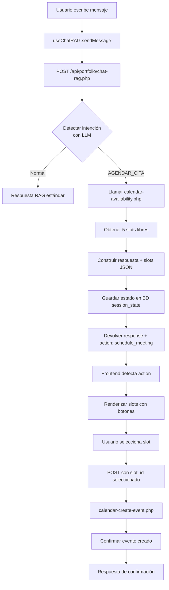

# 🗓️ Integración de Agendado de Citas en Chat RAG - Análisis y Propuesta

**Fecha**: 13 de abril de 2026  
**Versión**: 1.0  
**Autor**: GitHub Copilot + Juan Carlos Macías

---

## 📋 Situación Actual

### ✅ Lo que YA existe:

1. **Sistema Chat RAG conversacional** (`api/portfolio/chat-rag.php`)
   - Hook React `useChatRAG.js`
   - Componente `ChatModal.jsx`
   - Integración con Groq/OpenAI/GitHub Models
   - Sistema de prompts en BD (`chat_prompts` table)
   - Detección de voz (STT/TTS)
   - Logging detallado

2. **APIs de Google Calendar** (`api/portfolio/calendar-*.php`)
   - `calendar-lib.php` - Utilidades OAuth y API calls
   - `calendar-availability.php` - Obtener slots disponibles (FreeBusy + ventanas laborales)
   - `calendar-create-event.php` - Crear eventos
   - `calendar-auth-start.php` / `calendar-auth-callback.php` - OAuth flow

3. **Componente ScheduleMeeting** (`frontend/src/components/Scheduling/`)
   - UI standalone para agendar reuniones
   - Obtiene slots y permite reservar
   - **PROBLEMA**: Separado del chat, no conversacional

### ❌ Lo que FALTA:

1. **Detección de intenciones** en el chat
   - El LLM actual NO detecta cuando el usuario quiere agendar
   - No hay sistema de "actions" o "function calling"

2. **Integración conversacional**
   - El chat y el scheduling son dos sistemas independientes
   - No hay flujo multi-turno para agendar citas

3. **Respuesta estructurada**
   - El chat solo devuelve texto plano
   - No hay formato especial para slots/botones interactivos

4. **Estado de conversación**
   - No se mantiene estado como "esperando selección de slot"
   - No hay contexto de interacción de scheduling

---

## 🎯 Objetivo del Usuario

Quiere que el chat conversacional pueda:

```
Usuario: "Quiero agendar una cita contigo"
Bot: "¡Perfecto! Déjame consultar mi agenda..."

[El bot consulta Google Calendar]

Bot: "Tengo estos 5 horarios disponibles esta semana:
     
     1. 🗓️ Lunes 15 Abril - 10:00-10:30
     2. 🗓️ Lunes 15 Abril - 16:00-16:30
     3. 🗓️ Martes 16 Abril - 11:00-11:30
     4. 🗓️ Miércoles 17 Abril - 10:00-10:30
     5. 🗓️ Jueves 18 Abril - 16:30-17:00
     
     ¿Cuál te viene mejor?"

Usuario: "El número 3"
Bot: "Perfecto, he agendado la reunión para el Martes 16 Abril a las 11:00. 
     Te enviaré un email de confirmación. ¿Hay algo más en lo que pueda ayudarte?"
```

### 📊 Características deseadas:
- ✅ Detección automática de intención (AGENDAR_CITA)
- ✅ Consulta en tiempo real a Google Calendar
- ✅ Sugerencia de N slots (configurable, default 5)
- ✅ Selección interactiva (botones o números)
- ✅ Confirmación y creación del evento
- ✅ Integración visual en el chat modal
- ✅ Logging similar a Google Sheets (para analítica)

---

## 🏗️ Arquitectura Propuesta

### Opción Recomendada: **Sistema de Acciones Estructuradas**

**Ventajas**:
- Simple de implementar
- No requiere refactorización completa
- Compatible con providores LLM actuales (Groq, OpenAI, etc.)
- Permite extensibilidad futura (otras acciones)

**Desventajas**:
- No es "true function calling" (pero funciona igual)
- Requiere parseo de respuesta del LLM

### Flujo de Datos:



---

## 🔧 Implementación Técnica

### 1. Backend: Detección de Intenciones

#### 1.1. Crear nuevo prompt del sistema

**Tabla**: `chat_prompts`

```sql
INSERT INTO chat_prompts (prompt_name, prompt_type, prompt_text, variables, priority, is_active) VALUES
('intention_detection', 'system', 
'DETECCIÓN DE INTENCIONES:
Identifica cuando el usuario quiere realizar alguna de estas acciones:

🟣 AGENDAR_CITA - Palabras clave: "agendar", "cita", "reunión", "disponibilidad", "horario", "calendario"
🔵 CONSULTA - Preguntas generales sobre el portfolio
🟢 INFORMACION - Solicitud de información de servicios/proyectos

Si detectas que el usuario quiere agendar una cita, termina tu respuesta con:
[ACTION:SCHEDULE_MEETING]

Ejemplos:
- "Quiero agendar una cita" → Responde + [ACTION:SCHEDULE_MEETING]
- "¿Cuándo estás disponible?" → Responde + [ACTION:SCHEDULE_MEETING]
- "Necesito una reunión contigo" → Responde + [ACTION:SCHEDULE_MEETING]
- "Cuéntame sobre tus proyectos" → Solo responde (sin action)',
'["user_message"]', 
15, 
1);
```

#### 1.2. Modificar `chat-rag.php` para detectar acciones

```php
// Después de generar respuesta del LLM (línea ~360)
$botResponse = trim($response['content']);

// Detectar acciones en la respuesta
$action = null;
$actionData = null;

if (preg_match('/\[ACTION:(\w+)\]/', $botResponse, $matches)) {
    $action = $matches[1];
    // Limpiar el marcador de la respuesta visible
    $botResponse = trim(str_replace($matches[0], '', $botResponse));
    
    // Ejecutar acción según tipo
    switch($action) {
        case 'SCHEDULE_MEETING':
            $actionData = handleScheduleMeeting($sessionId);
            break;
    }
}

// Función para manejar agendado
function handleScheduleMeeting($sessionId) {
    // Llamar a calendar-availability.php internamente
    $start = date('c'); // Ahora
    $end = date('c', strtotime('+7 days')); // Próximos 7 días
    
    $availabilityEndpoint = __DIR__ . '/calendar-availability.php';
    
    // Simular POST request interno
    $_POST_backup = $_POST;
    $_SERVER_backup = $_SERVER;
    
    $_POST = [
        'start' => $start,
        'end' => $end,
        'duration_minutes' => 30,
        'timezone' => 'Europe/Madrid'
    ];
    $_SERVER['REQUEST_METHOD'] = 'POST';
    
    ob_start();
    include $availabilityEndpoint;
    $output = ob_get_clean();
    
    // Restaurar
    $_POST = $_POST_backup;
    $_SERVER = $_SERVER_backup;
    
    $data = json_decode($output, true);
    
    if ($data && $data['success']) {
        $slots = array_slice($data['data']['slots'] ?? [], 0, 5); // Top 5
        
        // Guardar en sesión para posterior selección
        saveSessionState($sessionId, [
            'awaiting_action' => 'slot_selection',
            'available_slots' => $slots,
            'created_at' => date('Y-m-d H:i:s')
        ]);
        
        return [
            'type' => 'schedule_meeting',
            'slots' => $slots,
            'message' => '¡Perfecto! He consultado mi agenda y tengo estos horarios disponibles:'
        ];
    }
    
    return null;
}

// Función para guardar estado de sesión
function saveSessionState($sessionId, $state) {
    $db = Database::getInstance();
    
    // Crear tabla si no existe
    $db->execute("
        CREATE TABLE IF NOT EXISTS chat_session_state (
            session_id VARCHAR(100) PRIMARY KEY,
            state_data JSON NOT NULL,
            created_at TIMESTAMP DEFAULT CURRENT_TIMESTAMP,
            updated_at TIMESTAMP DEFAULT CURRENT_TIMESTAMP ON UPDATE CURRENT_TIMESTAMP,
            INDEX idx_created_at (created_at)
        )
    ");
    
    $stateJson = json_encode($state);
    
    // Upsert
    $existing = $db->fetchOne("SELECT session_id FROM chat_session_state WHERE session_id = ?", [$sessionId]);
    if ($existing) {
        $db->execute("UPDATE chat_session_state SET state_data = ? WHERE session_id = ?", [$stateJson, $sessionId]);
    } else {
        $db->execute("INSERT INTO chat_session_state (session_id, state_data) VALUES (?, ?)", [$sessionId, $stateJson]);
    }
}

// Modificar la respuesta JSON final
calendar_json_response(true, [
    'response' => $botResponse,
    'session_id' => $sessionId,
    'timestamp' => date('Y-m-d H:i:s'),
    'action' => $action,
    'action_data' => $actionData,
    'rag_context' => array_slice($ragResults, 0, 3),
    'metadata' => [
        'llm_provider' => $llmProvider,
        'model' => $model,
        'tokens_used' => $response['tokens_used'] ?? 0,
        'processing_time' => (microtime(true) - $startTime) * 1000
    ]
]);
```

#### 1.3. Manejar selección de slot

Cuando el usuario responde "el 3" o "opción 2", necesitamos:

```php
// Al inicio de chat-rag.php, antes de llamar al LLM

// Verificar si hay estado de sesión pendiente
$sessionState = getSessionState($sessionId);

if ($sessionState && $sessionState['awaiting_action'] === 'slot_selection') {
    // Usuario está seleccionando un slot
    $slotSelection = detectSlotSelection($userMessage, $sessionState['available_slots']);
    
    if ($slotSelection !== null) {
        // Crear evento
        $slot = $sessionState['available_slots'][$slotSelection];
        $result = createMeetingEvent($slot);
        
        if ($result['success']) {
            // Limpiar estado
            clearSessionState($sessionId);
            
            // Responder directamente
            calendar_json_response(true, [
                'response' => "✅ ¡Perfecto! He agendado la reunión para el {$slot['formatted_start']}. " .
                             "Te enviaré un email de confirmación. ¿Hay algo más en lo que pueda ayudarte?",
                'session_id' => $sessionId,
                'timestamp' => date('Y-m-d H:i:s'),
                'action' => 'meeting_created',
                'action_data' => [
                    'event_id' => $result['event_id'],
                    'slot' => $slot
                ]
            ]);
        }
    }
}

function detectSlotSelection($message, $slots) {
    $message = strtolower(trim($message));
    
    // Detectar números (1-5)
    if (preg_match('/(?:opción|slot|número|el)?\s*(\d+)/', $message, $matches)) {
        $num = (int)$matches[1];
        if ($num >= 1 && $num <= count($slots)) {
            return $num - 1; // Index 0-based
        }
    }
    
    return null;
}

function createMeetingEvent($slot) {
    // Similar a handleScheduleMeeting, llamar internamente a calendar-create-event.php
    // ...
}
```

---

### 2. Frontend: Renderizar Slots Interactivos

#### 2.1. Modificar `useChatRAG.js`

```javascript
// Después de recibir respuesta (línea ~110)
if (data.success) {
    const botMsg = {
        id: Date.now() + 1,
        text: data.data.response,
        sender: 'bot',
        timestamp: data.data.timestamp,
        metadata: {
            ragContext: data.data.rag_context,
            llmProvider: data.data.metadata.llm_provider,
            model: data.data.metadata.model
        },
        suggestedQuestions: data.data.suggested_questions || [],
        
        // NUEVO: Manejar acciones
        action: data.data.action || null,
        actionData: data.data.action_data || null
    };
    
    setMessages(prev => [...prev, botMsg]);
    
    // Si hay voz y no es acción de scheduling (para no leer slots)
    if (voiceEnabled && data.data.voice_text && !data.data.action) {
        await speakText(data.data.voice_text);
    }
    
    return botMsg;
}
```

#### 2.2. Crear componente `SchedulingSlots.jsx`

```jsx
import React from 'react';
import { Button } from 'react-bootstrap';
import './SchedulingSlots.css';

/**
 * Renderiza slots de calendario interactivos en el chat
 */
const SchedulingSlots = ({ slots, onSelect, disabled = false }) => {
    if (!slots || slots.length === 0) return null;
    
    const formatSlot = (slot) => {
        const start = new Date(slot.start);
        const options = { 
            weekday: 'long', 
            day: 'numeric', 
            month: 'long', 
            hour: '2-digit', 
            minute: '2-digit' 
        };
        return start.toLocaleDateString('es-ES', options);
    };
    
    return (
        <div className="scheduling-slots">
            <div className="slots-header">
                <span className="icon">🗓️</span>
                <span className="text">Horarios disponibles:</span>
            </div>
            
            <div className="slots-list">
                {slots.map((slot, index) => (
                    <div key={index} className="slot-item">
                        <div className="slot-info">
                            <span className="slot-number">{index + 1}</span>
                            <span className="slot-date">{formatSlot(slot)}</span>
                        </div>
                        <Button
                            variant="success"
                            size="sm"
                            onClick={() => onSelect(index)}
                            disabled={disabled}
                        >
                            Seleccionar
                        </Button>
                    </div>
                ))}
            </div>
            
            <div className="slots-hint">
                💡 También puedes escribir el número (ej: "el 3")
            </div>
        </div>
    );
};

export default SchedulingSlots;
```

#### 2.3. Modificar `MessageRenderer.jsx`

```jsx
import SchedulingSlots from './SchedulingSlots';

const MessageRenderer = ({ message, onSlotSelect }) => {
    // ... código existente ...
    
    // Renderizar acción de scheduling
    if (message.action === 'schedule_meeting' && message.actionData?.slots) {
        return (
            <div className="message bot-message">
                <div className="message-text">
                    {message.text}
                </div>
                
                <SchedulingSlots 
                    slots={message.actionData.slots}
                    onSelect={(index) => onSlotSelect(index, message.actionData.slots)}
                />
            </div>
        );
    }
    
    // Mensaje normal
    return (
        <div className={`message ${message.sender}-message`}>
            {/* Renderizado normal */}
        </div>
    );
};
```

#### 2.4. Actualizar `ChatModal.jsx`

```jsx
const ChatModal = ({ isOpen, onClose }) => {
    const {
        messages,
        sendMessage,
        // ... resto
    } = useChatRAG();
    
    // Handler para selección de slot
    const handleSlotSelection = useCallback((slotIndex, slots) => {
        const slot = slots[slotIndex];
        
        // Enviar mensaje automático con selección
        sendMessage(`Selecciono el slot ${slotIndex + 1}`, {
            slot_selection: {
                index: slotIndex,
                slot_id: slot.start
            }
        });
    }, [sendMessage]);
    
    return (
        <Modal show={isOpen} onHide={onClose} size="lg">
            {/* ... header ... */}
            
            <Modal.Body>
                <div className="messages-container">
                    {messages.map(msg => (
                        <MessageRenderer 
                            key={msg.id} 
                            message={msg}
                            onSlotSelect={handleSlotSelection}
                        />
                    ))}
                </div>
            </Modal.Body>
            
            {/* ... resto ... */}
        </Modal>
    );
};
```

---

### 3. Estilos CSS

#### `SchedulingSlots.css`

```css
.scheduling-slots {
    background: linear-gradient(135deg, #667eea 0%, #764ba2 100%);
    border-radius: 12px;
    padding: 16px;
    margin-top: 12px;
    color: white;
}

.slots-header {
    display: flex;
    align-items: center;
    gap: 8px;
    margin-bottom: 12px;
    font-weight: 600;
    font-size: 16px;
}

.slots-header .icon {
    font-size: 24px;
}

.slots-list {
    display: flex;
    flex-direction: column;
    gap: 8px;
}

.slot-item {
    background: rgba(255, 255, 255, 0.1);
    border: 1px solid rgba(255, 255, 255, 0.2);
    border-radius: 8px;
    padding: 12px;
    display: flex;
    justify-content: space-between;
    align-items: center;
    transition: all 0.2s;
}

.slot-item:hover {
    background: rgba(255, 255, 255, 0.2);
    transform: translateX(4px);
}

.slot-info {
    display: flex;
    align-items: center;
    gap: 12px;
}

.slot-number {
    background: rgba(255, 255, 255, 0.3);
    border-radius: 50%;
    width: 32px;
    height: 32px;
    display: flex;
    align-items: center;
    justify-content: center;
    font-weight: bold;
}

.slot-date {
    font-size: 14px;
}

.slots-hint {
    margin-top: 12px;
    font-size: 12px;
    opacity: 0.8;
    text-align: center;
}
```

---

## 📊 Logging y Analítica

### Tabla de eventos de scheduling

```sql
CREATE TABLE IF NOT EXISTS scheduling_events (
    id INT AUTO_INCREMENT PRIMARY KEY,
    session_id VARCHAR(100) NOT NULL,
    event_type ENUM('slots_shown', 'slot_selected', 'meeting_created', 'meeting_failed') NOT NULL,
    event_data JSON,
    user_ip VARCHAR(45),
    user_agent TEXT,
    created_at TIMESTAMP DEFAULT CURRENT_TIMESTAMP,
    
    INDEX idx_session_id (session_id),
    INDEX idx_event_type (event_type),
    INDEX idx_created_at (created_at)
);
```

### Función de logging

```php
function logSchedulingEvent($sessionId, $eventType, $eventData) {
    $db = Database::getInstance();
    
    $db->execute(
        "INSERT INTO scheduling_events (session_id, event_type, event_data, user_ip, user_agent) 
         VALUES (?, ?, ?, ?, ?)",
        [
            $sessionId,
            $eventType,
            json_encode($eventData),
            $_SERVER['REMOTE_ADDR'] ?? 'unknown',
            $_SERVER['HTTP_USER_AGENT'] ?? 'unknown'
        ]
    );
}

// Usar en puntos clave:
logSchedulingEvent($sessionId, 'slots_shown', ['count' => count($slots)]);
logSchedulingEvent($sessionId, 'slot_selected', ['slot_index' => $slotIndex]);
logSchedulingEvent($sessionId, 'meeting_created', ['event_id' => $eventId]);
```

---

## 🚀 Plan de Implementación

### Fase 1: Backend (2-3 horas)
1. ✅ Crear prompt de detección de intenciones
2. ✅ Modificar `chat-rag.php` para detectar `[ACTION:SCHEDULE_MEETING]`
3. ✅ Implementar `handleScheduleMeeting()` con llamada interna a calendar API
4. ✅ Crear tabla `chat_session_state` para mantener contexto
5. ✅ Implementar detección de selección de slot
6. ✅ Testing de flujo con Postman/curl

### Fase 2: Frontend (2-3 horas)
1. ✅ Crear componente `SchedulingSlots.jsx`
2. ✅ Modificar `MessageRenderer.jsx` para renderizar slots
3. ✅ Actualizar `ChatModal.jsx` con handler de selección
4. ✅ Añadir estilos CSS
5. ✅ Testing de UI y UX

### Fase 3: Logging y Optimización (1-2 horas)
1. ✅ Crear tabla `scheduling_events`
2. ✅ Implementar logging en puntos clave
3. ✅ Añadir validaciones y error handling
4. ✅ Testing de casos edge (slots vacíos, errores de calendario, etc.)

### Fase 4: Testing E2E (1 hora)
1. ✅ Flujo completo: Intención → Slots → Selección → Confirmación
2. ✅ Casos edge: Sin disponibilidad, errores de Google Calendar, OAuth no configurado
3. ✅ Test en múltiples navegadores
4. ✅ Validar notificaciones de Telegram (si están habilitadas)

**Tiempo total estimado**: 6-9 horas

---

## 🎯 Alternativas Consideradas

### Alternativa 1: Function Calling Nativo de OpenAI
- **Pros**: Más robusto, estándar de la industria
- **Contras**: Solo funciona con OpenAI, requiere refactorización mayor
- **Decisión**: Descartado por ahora, implementar en Fase 2 futura

### Alternativa 2: Estado en localStorage frontend
- **Pros**: Más simple, no requiere BD
- **Contras**: No persiste entre sesiones, no tiene logging
- **Decisión**: Descartado, preferimos tracking completo

### Alternativa 3: Componente standalone de scheduling en modal separado
- **Pros**: Separación de responsabilidades
- **Contras**: Rompe la experiencia conversacional
- **Decisión**: Descartado, el usuario quiere integración conversacional

---

## 📈 Métricas de Éxito

Después de implementar, medir:

1. **Tasa de conversión de intención a cita creada**
   ```sql
   SELECT 
       COUNT(CASE WHEN event_type = 'slots_shown' THEN 1 END) as intenciones,
       COUNT(CASE WHEN event_type = 'meeting_created' THEN 1 END) as conversiones,
       ROUND(COUNT(CASE WHEN event_type = 'meeting_created' THEN 1 END) * 100.0 / 
             COUNT(CASE WHEN event_type = 'slots_shown' THEN 1 END), 2) as conversion_rate
   FROM scheduling_events
   WHERE created_at >= DATE_SUB(NOW(), INTERVAL 30 DAY);
   ```

2. **Tiempo promedio desde intención hasta confirmación**

3. **Tasa de abandono en selección de slot**

4. **Errores de calendario vs éxitos**

---

## 🔒 Consideraciones de Seguridad

1. **Rate limiting** en detección de intenciones (evitar spam de consultas a Google Calendar)
2. **Validación** de slots seleccionados (verificar que el slot aún está disponible)
3. **Sanitización** de inputs del usuario antes de crear eventos
4. **OAuth scope mínimo** necesario (solo calendar.events)
5. **No exponer** tokens de acceso en respuestas del chat

---

## 🎨 Mockup de UX

```
┌─────────────────────────────────────────┐
│ Chat Conversacional                     │
├─────────────────────────────────────────┤
│                                         │
│  🧑 Usuario:                            │
│  Quiero agendar una reunión             │
│                                         │
│  🤖 Asistente:                          │
│  ¡Perfecto! Déjame consultar mi agenda  │
│                                         │
│  ┌──────────────────────────────────┐  │
│  │ 🗓️ Horarios disponibles:         │  │
│  │                                  │  │
│  │ ┌──────────────────────────┐    │  │
│  │ │ 1  Lunes 15 Abr - 10:00  │ ✓  │  │
│  │ └──────────────────────────┘    │  │
│  │ ┌──────────────────────────┐    │  │
│  │ │ 2  Lunes 15 Abr - 16:00  │ ✓  │  │
│  │ └──────────────────────────┘    │  │
│  │ ┌──────────────────────────┐    │  │
│  │ │ 3  Martes 16 Abr - 11:00 │ ✓  │  │
│  │ └──────────────────────────┘    │  │
│  │                                  │  │
│  │ 💡 Escribe el número o haz clic │  │
│  └──────────────────────────────────┘  │
│                                         │
│  🧑 Usuario:                            │
│  El 3                                   │
│                                         │
│  🤖 Asistente:                          │
│  ✅ ¡Perfecto! He agendado la reunión  │
│  para el Martes 16 Abril a las 11:00.  │
│  Te enviaré un email de confirmación.  │
│                                         │
└─────────────────────────────────────────┘
```

---

## ✅ Conclusión

Esta propuesta implementa el flujo conversacional de agendado de citas solicitado de forma:

- **Escalable**: Permite agregar más "actions" en el futuro
- **Mantenible**: Reutiliza infraestructura existente
- **Auditable**: Logging completo de interacciones
- **UX Superior**: Experiencia fluida sin salir del chat
- **Rápida**: 6-9 horas de desarrollo estimadas

¿Procedemos con la implementación?

